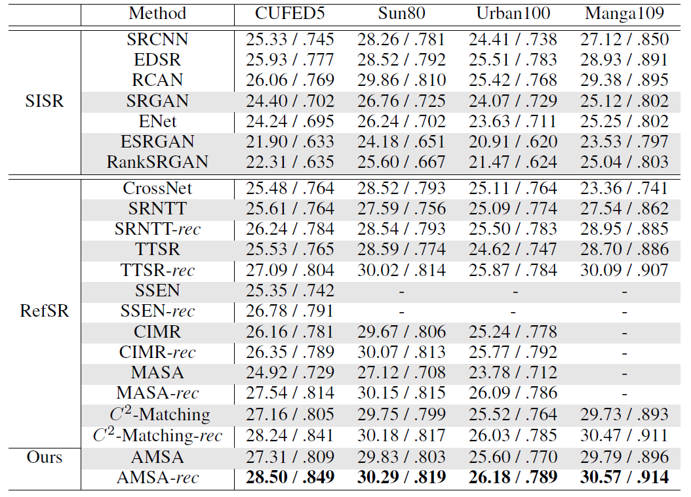

# AMSA
This project is the official implementation of 'Coarse-to-Fine Embedded PatchMatch and Multi-Scale Dynamic Aggregation for Reference-based Super-Resolution', AAAI22

The code framework is mainly modified from [BasicSR](https://github.com/xinntao/BasicSR) and [MMSR](https://github.com/open-mmlab/mmediting) (Now reorganized as MMEditing). Please refer to the original repo for more usage and documents.


[[Paper](https://arxiv.org/abs/2201.04358)]
[[Project Page](https://github.com/Zj-BinXia/AMSA)]

## Dependencies and Installation

- Python >= 3.7
- PyTorch == 1.4
- CUDA 10.0 
- GCC 5.4.0

1. Install Dependencies

   ```bash
   cd AMSA
   conda install pytorch=1.4.0 torchvision cudatoolkit=10.0 -c pytorch
   pip install mmcv==0.4.4
   pip install -r requirements.txt
   ```

1. Install MMSR and DCNv2

    ```bash
    python setup.py develop
    cd mmsr/models/archs/DCNv2
    python setup.py build develop
    ```


## Dataset Preparation

- Train Set: [CUFED Dataset](https://drive.google.com/drive/folders/1hGHy36XcmSZ1LtARWmGL5OK1IUdWJi3I)
- Test Set: [CUFED5 Dataset](https://drive.google.com/file/d/1Fa1mopExA9YGG1RxrCZZn7QFTYXLx6ph/view)

Please refer to [Datasets.md](datasets/DATASETS.md) for pre-processing and more details.

## Get Started

### Pretrained Models
Downloading the pretrained models from GogleDrive (TODO) and put them under `experiments/pretrained_models folder`.

### Test

We provide quick test code with the pretrained model.

1. Modify the paths to dataset and pretrained model in the following yaml files for configuration.

    ```bash
    ./options/test/test_C2_matching.yml
    ./options/test/test_C2_matching_mse.yml
    ```

1. Run test code for models trained using **GAN loss**.

    ```bash
    python mmsr/test.py -opt "options/test/test_C2_matching.yml"
    ```

   Check out the results in `./results`.

1. Run test code for models trained using only **reconstruction loss**.

    ```bash
    python mmsr/test.py -opt "options/test/test_C2_matching_mse.yml"
    ```

   Check out the results in in `./results`


### Train

Downloading the pretrained feature extraction models from C2-Matching  [link](https://drive.google.com/drive/folders/1dTkXMzeBrHelVQUEx5zib5MdmvqDaSd9?usp=sharing) and put "feature_extraction.pth" under `experiments/pretrained_models folder`.

All logging files in the training process, *e.g.*, log message, checkpoints, and snapshots, will be saved to `./experiments` and `./tb_logger` directory.


1.  Train restoration network.
   ```bash
   # add the path to *pretrain_model_feature_extractor* in the following yaml
   # the path to *pretrain_model_feature_extractor* is the model obtained in C2-Matching
   ./options/train/stage3_restoration_gan.yml
   python mmsr/train.py -opt "options/train/stage3_restoration_gan.yml"

   # if you wish to train the restoration network with only mse loss
   # prepare the dataset path and pretrained model path in the following yaml
   ./options/train/stage3_restoration_mse.yml
   python mmsr/train.py -opt "options/train/stage3_restoration_mse.yml"
   ```

## Results




## Citation

   If you find our repo useful for your research, please consider citing our paper:

   ```bibtex
   @article{xia2022coarse,
  title={Coarse-to-Fine Embedded PatchMatch and Multi-Scale Dynamic Aggregation for Reference-based Super-Resolution},
  author={Xia, Bin and Tian, Yapeng and Hang, Yucheng and Yang, Wenming and Liao, Qingmin and Zhou, Jie},
  booktitle={AAAI},
  year={2022}
}
   ```
